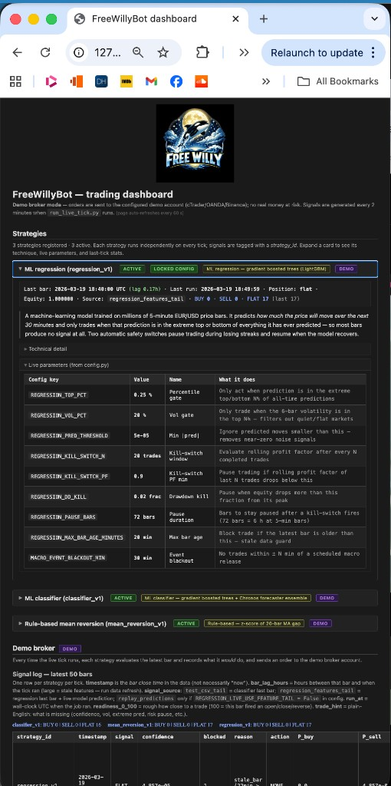
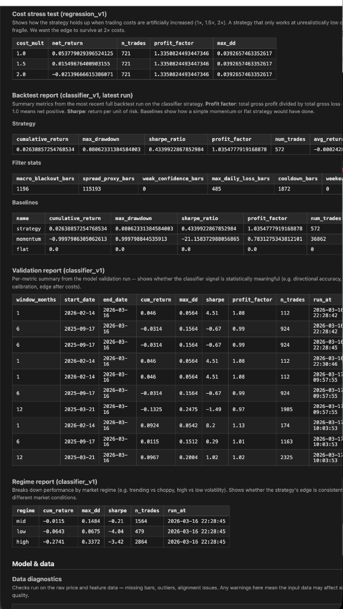

# FreeWillyBot

<p align="center">
  
</p>

Live trading system as well as research and paper-trading stack, currently for **5-minute EUR/USD** (configurable). **AI/ML** forecasting (classifier + regression) plus a **rule-based mean reversion** strategy, walk-forward validation, and backtests with costs and risk controls. **Wired for cTrader** for live data and execution as well as paper/demo trading. Multi-strategy signals and a local web dashboard.

### Dashboard

| Strategies & signal log | Backtest & validation |
|------------------------|------------------------|
|  |  |

---

## What’s in the box

| Piece | Description |
|-------|-------------|
| **Classifier strategy** (`classifier_v1`) | XGBoost-style directional model with session, volatility, and confidence filters. |
| **Regression strategy** (`regression_v1`) | Return forecast + extreme selection (top/bottom predictions, vol filter) + **kill switch** (rolling profit factor) + **drawdown pause**. Production parameters are locked in `src/config.py` under `REGRESSION_*`. |
| **Mean reversion strategy** (`mean_reversion_v1`) | Rule-based: z-score of 20-bar MA gap; BUY/SELL when price stretches too far from its average, with session/macro/vol filters and kill-switch. No ML — deterministic and interpretable. |
| **Paper trading** | `scripts/run_live_tick.py` runs every strategy each tick: signals → `predictions_live.csv`. **Paper execution is on by default**: per-strategy simulated position + equity (bar-by-bar returns), logged to `trade_decisions.csv` and `paper_simulation.csv`. Use `--demo-broker` (or `RUN_LIVETICK_DEMO_BROKER=1`) to send real orders to the configured demo broker (cTrader/OANDA/Binance). Use `--no-execute` for signals only. |
| **Dashboard** | Flask app: metrics, walk-forward tables, cost stress, live signal log, simulated vs (future) real trade sections. |

Data pipeline: Dukascopy for historical; **cTrader** for live data and trades (plus optional cross-asset / macro). See `src/config.py` for symbol, bar size, train/validation/test dates, and execution flags.

---

## Requirements

- **Python 3.11+** recommended (some optional deps may differ on 3.12).
- Create a venv and install:

```bash
python -m venv .venv
source .venv/bin/activate   # Windows: .venv\Scripts\activate
pip install -r requirements.txt
```

Optional: copy `.env.example` to `.env` if you use FRED or broker APIs (see project docs / `python-dotenv` usage).

---

## Quick start

```bash
source .venv/bin/activate

# One-off: refresh prices & features (see scripts/run_daily_data_refresh.py)
python -m scripts.run_daily_data_refresh

# Paper tick: signals + simulated trades & equity (default)
python scripts/run_live_tick.py

# If the Mac was asleep/off, the next run auto-runs `run_daily_data_refresh` when the heartbeat is stale
# (see `LIVETICK_STALE_MINUTES` in `src/config.py`). Use `--no-auto-refresh` to skip that.

# Signals only (no trade_decisions / equity file)
python scripts/run_live_tick.py --no-execute

# Demo broker: send real orders to cTrader/OANDA/Binance demo (after paper looks good)
python scripts/run_live_tick.py --demo-broker
# Or set RUN_LIVETICK_DEMO_BROKER=1 in .env so launchd uses demo broker automatically.

# Web dashboard (default http://localhost:5050)
python scripts/run_dashboard.py
# or: ./scripts/run_dashboard.sh
```

---

## Docker (Linux 24/7)

Run the bot in Docker on a Linux machine (e.g. Kubuntu) so it keeps running after you close the terminal. Data and state live in `./data` on the host, so they survive `git pull` and image rebuilds.

**First-time setup on the Linux box:**

```bash
git clone <repo-url> FreeWillyBot && cd FreeWillyBot
cp .env.example .env   # edit if you use FRED or broker APIs; can leave empty for paper-only
docker compose up -d --build
```

The **livetick** container runs the paper-trading loop every 2 minutes (same as the Mac launchd job). To change the interval, set `LIVETICK_INTERVAL_SEC` in `docker-compose.yml` or in `.env`.

**Optional — one-off data refresh or train (e.g. after first clone or to catch up):**

```bash
docker compose run --rm bot scripts.run_daily_data_refresh
docker compose run --rm bot scripts.run_train_regression   # if you need a fresh model
```

**Optional — web dashboard** (Flask on port 5050):

```bash
docker compose --profile dashboard up -d
# Open http://localhost:5050 (or http://<machine-ip>:5050 from another device)
```

**After a git pull:** `docker compose up -d --build` to rebuild and restart. Your `data/` and `.env` are unchanged.

**Logs:** `docker compose logs -f bot`

**Cron (native Linux, same as Mac):** To run the same schedule with cron on the host (e.g. at `/home/tom/dev/FreeWillyBot`) instead of Docker, see **[docs/CRON_LINUX.md](docs/CRON_LINUX.md)**. Use `./scripts/install_cron.sh` to install the crontab.

---

## Project layout (high level)

```
data/
  processed/          # Cleaned prices, aligned series
  features/           # Classifier feature tables
  features_regression_core/   # Regression features
  models/             # Saved models, feature lists, configs
  predictions/        # Live/paper signal CSV
  predictions_regression/   # e.g. test_predictions.parquet
  backtests/          # Classifier backtest JSON reports
  backtests_regression/     # Walk-forward, grid, cost stress CSVs
  logs/               # Execution, cron logs
scripts/              # Entry points (refresh, train, backtest, dashboard, …)
src/                  # Core logic (features, training, backtest, live_signal*, execution)
```

---

## Useful scripts

| Script | Purpose |
|--------|---------|
| `run_daily_data_refresh.py` | Update price data; rebuild classifier features + **regression core** features (so live regression `timestamp` stays current). |
| `run_daily_retrain.py` | Scheduled retrain path for classifier pipeline. |
| `run_train_regression.py` | Train regression model. |
| `predict_regression_test.py` | Build test-set predictions (e.g. for regression paper replay). |
| `run_backtest_regression.py` | Regression grid / single backtest. |
| `run_walk_forward_regression.py` | Rolling walk-forward on regression strategy. |
| `run_cost_stress_regression.py` | Cost multiplier stress test. |
| `run_validate.py` / `run_full_validate.py` | Classifier validation reports. |
| `run_data_diagnostics.py` | Data quality checks. |

Adding a new strategy: implement `run(n_bars=1)` returning signal dicts, then register it in `STRATEGIES` inside `scripts/run_live_tick.py`.

---

## Configuration

All shared settings live in **`src/config.py`**: symbol, bar interval, train/test windows, spread/cost assumptions, classifier filters, and **locked regression production parameters** (`REGRESSION_TOP_PCT`, `REGRESSION_VOL_PCT`, `REGRESSION_PRED_THRESHOLD`, kill switch and drawdown settings).

---

## Next stages

Planned or partially wired features to make the stack richer:

| Area | What’s coming / in the pipeline |
|------|----------------------------------|
| **News** | GDELT GKG ingestion and sentiment (e.g. FinBERT) as model inputs; ablation path already in place (`USE_NEWS`, `run_ablation.py`). |
| **Cross-asset** | SP500, VIX, gold, oil, and rates (e.g. 10Y) as aligned features; downloads and alignment scripts exist; optional in training and live. |
| **Macro** | FRED series (CPI, Fed funds, Treasury) and an event calendar; macro blackout windows to avoid trading through major releases. |
| **More assets** | Extend beyond EUR/USD (e.g. more FX or instruments) with the same pipeline and cTrader/data wiring. |
| **Forecasters** | Optional Chronos-style forecasters in the refresh pipeline for extra signal. |

These are the next stages we’re feeding in; config and scripts are set up so they can be turned on as they’re validated.

---

## Disclaimer

This is **research software**, not financial advice. Forex trading is risky. The default configuration does not place live orders; enabling real execution requires explicit config changes and your own broker compliance. Use at your own risk.

